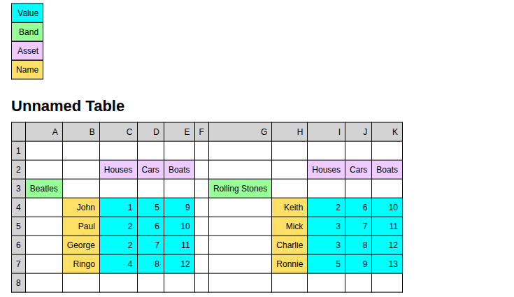
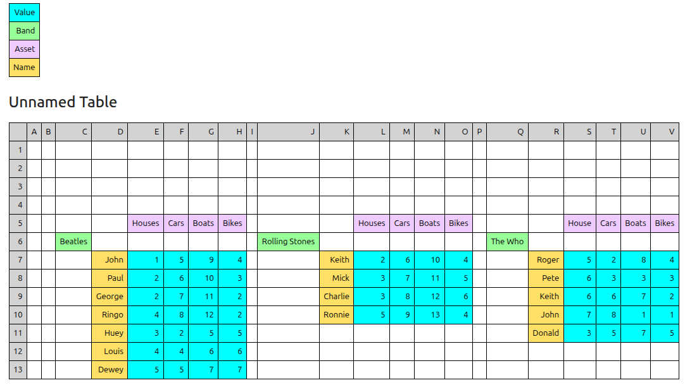

# Tidychef


🧠 **A Different Way to Work with Tabular Data** - tidychef is built on a simple but powerful idea: **extract data the way humans interpret it — by visual structure, not by fixed positions.**

Whether your data comes from spreadsheets, CSVs, or other visually structured exports, tidychef lets you write declarative, repeatable recipes that work across inconsistent and evolving layouts.

It's designed for real-world use: publication tables, official statistics, internal reports — anything where the structure is for people, not machines.

**This isn't just a different tool. It's a different mindset.**


| 👤 You are...             | 🧩 Your problem...                                           | ✅ Tidychef helps by...                                       |
| ------------------------- | ------------------------------------------------------------ | ------------------------------------------------------------ |
| A policy analyst          | A quarterly Excel export with merged headers and wide layout | Extracting data using visual relationships, not cell indices |
| A finance/data consultant | Repetitive report formatting with shifting structures        | Writing reusable “recipes” that adapt to visual changes      |
| A data engineer           | Need to automate legacy spreadsheets                         | Building robust, declarative extractors in Python            |

Here's a short [AI generated analysis](https://mikeadamss.github.io/tidychef/ai-overview) of tidychef of how it relates to other tools in this space, it's probably worth a look if you're browsing and want to know if you ought to browse more.


## 📊 Simple Example: Extracting Spatially Structured Data

Consider this table where the data relationship are predominantly for human consumption (i.e they're defined by relative visual/spacial postitioning).

This is too messy for clean extraction with Pandas but just right for tidychef.


You write a fairly concise script

```python
from tidychef import acquire, filters, preview
from tidychef.direction import down, right, below
from tidychef.output import Column, TidyData

# Load a CSV table from a URL
table = acquire.csv.http(
    "https://raw.githubusercontent.com/mikeAdamss/tidychef/main/tests/fixtures/csv/bands-wide.csv"
)

# Select numeric observations and label them
observations = table.is_numeric().label_as("Value")

# Label headers
bands = table.row_containing_strings(["Beatles"]).is_not_blank().label_as("Band")
assets = table.row_containing_strings(["Cars"]).is_not_blank().label_as("Asset")
names = table.cell_containing_string("Beatles").shift(down).box_select().is_not_numeric().label_as("Name")
preview(observations, bands, assets, names)

# Build tidy data by associating observations with their corresponding headers
tidy_data = TidyData(
    observations,
    # the observations are closest to the right of bands
    Column(bands.finds_observations_closest(right)),
    # the observations are directly below assets
    Column(assets.finds_observations_directly(below)),
    # the observations are directyl right of names
    Column(names.finds_observations_directly(right)),
)

# Export the tidy data to CSV
tidy_data.to_csv("bands_tidy.csv")
```

which make will get you an inline preview (because we used `preview()` in the snippet)



and will putput a csv (`band_tidy.csv` as per the snippet) that looks like this:


_Note: image cropped for reasons of practicality._


💡 💡 **KEY INSIGHT** 💡💡

This is the bit you need to understand above all - here’s a preview I've made from running **the exact same script** against a _radically altered data source_. This is what we mean by _robust_ and _repeatable_ transformations and why the focus of tidychef is modeling spatial relationships — how cells relate visually, not where they are.

💡 Same script, radically different input—same output structure.



Even when data changes (as it will if you're working with any kind of regular publication) the _spatial relationships_ rarely change and typically only in ways that can be accounted for with a little care.


## Installation

```
pip install tidychef
```


## Why use tidychef?

🧠 Visual logic — Extract data based on how it's laid out (above, beside, under), not just raw coordinates or tidy input.

🔁 Repeatable & reliable — Define logic once and reuse it across similar—but not identical—files.

💬 Beginner-friendly — Designed for analysts and non-programmers to write recipes in simple Python.

📦 Interoperable — Outputs tidy pandas DataFrames or CSVs, ready for analysis in Python or R.

🧱 Built for real-world data — Handles spreadsheets with multi-level headers, merged cells, footnotes, and visual groupings that traditional tools struggle with.

🧑‍💼 Built for—and with—real data practitioners

📈 Robust to evolving layouts: Rather than relying on fixed coordinates, tidychef locates data by interpreting spatial relationships, allowing your extraction scripts to flexibly handle new or shifted data.

Currently supported input formats are `xls`, `xlsx`, `ods` and `csv`. Though users can add additional formats relatively easily and without a codebase change being necessary.

Tidychef is **designed to allow even novice python users or analysts to quickly become productive** but also has an advanced feature set and is designed to be readily and easily extended (adding new source of tabulated data, your own use case specific methods and filters and domain specific validation etc are all possible and documented in detail).

Extensive [training materials, examples and technical documentation can be found here](https://mikeadamss.github.io/tidychef/intro.html#).

## Acknowledgements

Tidychef is directly inspired by the python package [databaker](https://github.com/sensiblecodeio/databaker) created by [The Sensible Code Company](https://sensiblecode.io/) in partnership with the United Kingdoms [Office For National Statistics](https://www.ons.gov.uk/).

While I liked [databaker](https://github.com/sensiblecodeio/databaker) and successfully worked with it on multiple ETL projects over the course of almost a decade, I do consider this software the culmination of that work and the lessons learned from that time.

## Get Involved

Please raise issues (or ideas as issues) freely on this repo.

If you'd like to get involved more directly then please see [contributing](./docs/CONTRIBUTING.md) guidance.
