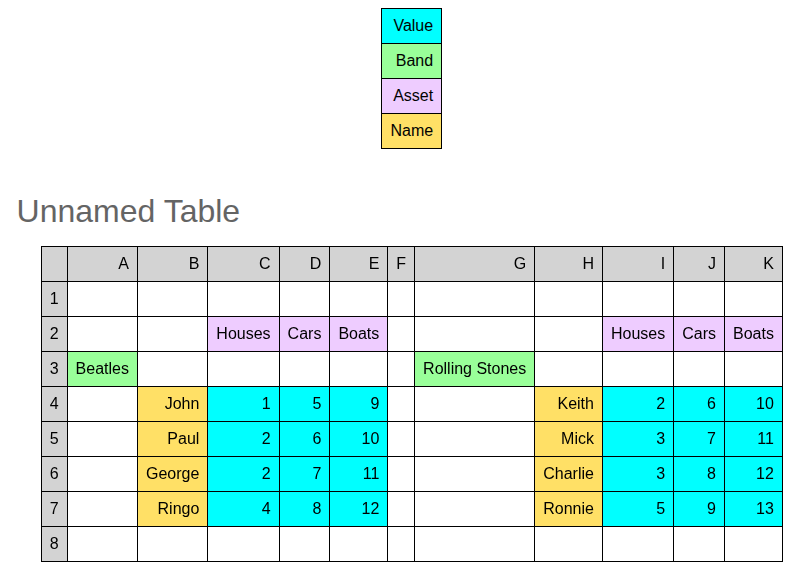

# Tidychef


Tidychef is a python framework to enable “data extraction for humans” via simple python beginner friendly "recipes". It aims at allowing users to easily transform tabulated data sources that use visual relationships (human readable only data) into simple machine readable "tidy data" in a repeatable way.

## Why use tidychef?

- Specialized for visually complex and irregular tabular data — tidychef excels at extracting and reshaping data from spreadsheets and CSVs with non-standard layouts, footers, merged headers, and spatial cues that traditional tools like pandas or tidyverse can struggle to parse directly.

- Focus on the visual and spatial structure of data — unlike pandas or tidyverse, which operate on rectangular, “tidy” input, tidychef lets you declaratively select cells based on their relative position and visual grouping, preserving domain context.

- Complements pandas and tidyverse workflows — use tidychef to transform messy reports into tidy data, then leverage pandas or tidyverse for downstream analysis, visualization, and modeling.

- Designed for reproducibility and automation — its programmatic API reduces manual intervention common in spreadsheet wrangling, enabling reliable data pipelines.

- Ideal for domain experts and data engineers dealing with legacy or inconsistent Excel/CSV exports that don’t follow tidy data principles.


## Simple Example

Imagine a sheet of data relationship like the following that are only expressed spacially.


You write a fairly concise scipt

```python
from tidychef import acquire, filters
from tidychef.direction import right, below
from tidychef.output import TidyData, Column

# Load a CSV table from a URL
table = acquire.csv.http("https://raw.githubusercontent.com/mikeAdamss/tidychef/main/tests/fixtures/csv/bands-wide.csv")

# Select numeric observations and label them
observations = table.filter(filters.is_numeric).label_as("Value")

# Label headers based on their positions
bands = table.excel_ref("3").is_not_blank().label_as("Band")
assets = table.excel_ref("2").is_not_blank().label_as("Asset")
names = (table.excel_ref("B") | table.excel_ref("H")).is_not_blank().label_as("Name")

# Build tidy data by associating observations with their corresponding headers
tidy_data = TidyData(
    observations,
    Column(bands.finds_observations_closest(right)),
    Column(assets.finds_observations_directly(below)),
    Column(names.finds_observations_directly(right))
)

# Export the tidy data to CSV
tidy_data.to_csv("bands_tidy.csv")

```

which make will get you an inline preview (because we used `preview()` in the snippet)



and will putput a csv (`band_tidy.csv` as per the snippt) that looks like this:


_Note: image cropped for reasons of practicality._

Currently supported input formats are `xls`, `xlsx`, `ods` and `csv`. Though users can add additional formats relatively easily and without a codebase change being necessary.

Tidychef is **designed to allow even novice python users or analysts to quickly become productive** but also has an advanced feature set and is designed to be readily and easily extended (adding new source of tabulated data, your own use case specific methods and filters and domain specific validation etc are all possible and documented in detail).

In depth training material, examples and technical documentation [can be found here](https://mikeadamss.github.io/tidychef/intro.html#).

## Installation

```
pip install tidychef
```

## Acknowledgements

Tidychef is directly inspired by the python package [databaker](https://github.com/sensiblecodeio/databaker) created by [The Sensible Code Company](https://sensiblecode.io/) in partnership with the United Kingdoms [Office For National Statistics](https://www.ons.gov.uk/).

While I liked [databaker](https://github.com/sensiblecodeio/databaker) and successfully worked with it on multiple ETL projects over the course of almost a decade, this software should be considered the culmination of that work and the lessons learned from that time.