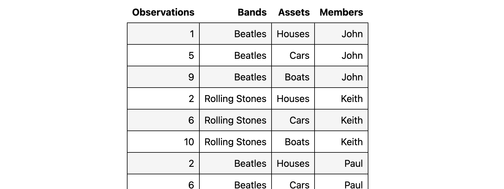

# Datachef


Datachef is a python framework to enable “data extraction for humans” via simple python beginner friendly "recipes". It aims at allowing users to easily transform tabulated data sources that use visual relationships (human readable only data) into simple machine readable "tidy data" in a repeatable way.

i.e: it allows you to reliably turn something that looks like this: 


into something that looks like this:


_Note: image cropped for reasons of practicality._

Datachef is **designed to allow even novice python users or analysts to quickly become productive** but also has an advanced feature set and is designed to be readily and easily extended (adding new source of tabulated data, new output formats, domain specific validation etc are all possible and documented in detail).

Examples, in depth training material and technical documentation [can be found here](https://mikeadamss.github.io/datachef/intro.html#).

## Installation

```
pip install datachef
```

## Acknowlagements

Datachef is directly inspired by the python package [databaker](https://github.com/sensiblecodeio/databaker) created by [The Sensible Code Company](https://sensiblecode.io/) in partnership with the United Kingdoms [Office For National Statistics](https://www.ons.gov.uk/).

While I liked [databaker](https://github.com/sensiblecodeio/databaker) and successfully worked with it on multiple ETL projects over the course of almost a decade, this software should be considered the culmination of that work and the lessons learned from that time.