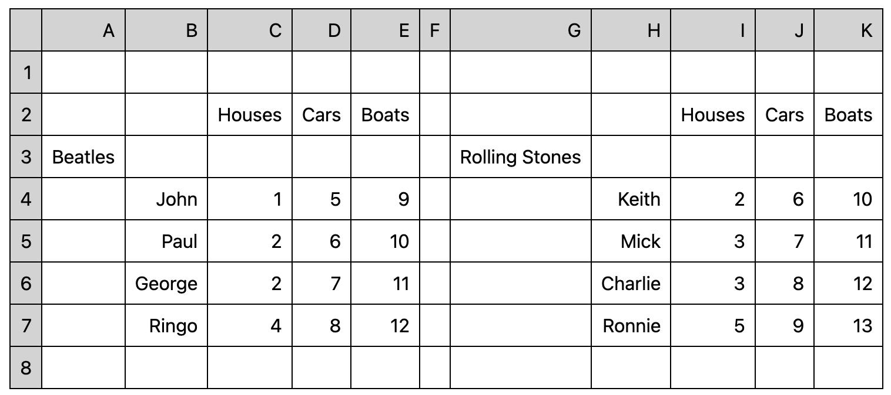

# Datachef


> :warning: This software is a **work in progress**.

Datachef is a python framework to enable “data extraction for humans” via simple python beginner friendly "recipes". It aims at allowing users to quick transform tabulated data sources using visual relationships (human readable only data) into simple machine readable formats.

i.e: it allows you to easily turn something that looks like this: 



into something that looks like this:


_Note: image cropped for reasons of practicality._

Datachef is **simple enough for even novice python users or analysts to quickly become productive** but also has an advanced feature set and is designed to be readily and easily extended (adding new source of tabulated data, new output formats, domain specific validation etc are all possible and documented in detail).

Documentation, examples and in depth training material [can be found here](https://mikeadamss.github.io/datachef/intro.html#).

## Installation

```
pip install datachef
```

## Acknowlagements

Datachef is directly inspired by the excellent python package [databaker](https://github.com/sensiblecodeio/databaker) created by [The Sensible Code Company](https://sensiblecode.io/) in partnership with the United Kingdoms [Office For National Statistics](https://www.ons.gov.uk/).

While I freely acknowledge taking inspiration from databakers method naming conventions (databaker has an excellent api for cell selection) and the great conceptual work done by that team, datachef is an entirely new codebase with completely new and different approaches to similar problems as well as a greatly slimmed down dependency chain (databaker is largely a wrapper, datachef a self contained thing in of itself) and uses a much more object orientated and consciously extensible design paradime.

Datachef also contains significant advances in functionality, performance at scale and test coverage.

That is to say, I liked [databaker](https://github.com/sensiblecodeio/databaker) and successfully worked with it on multiple projects for tidying messy data sources over the course of almost a decade, this software is the culmination of that work and the lessons learned from that time.