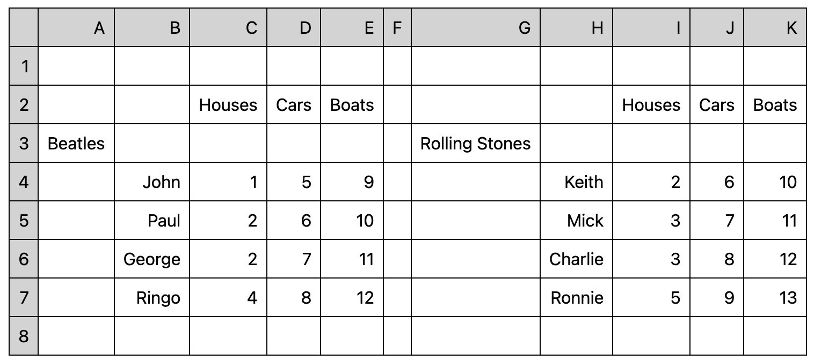
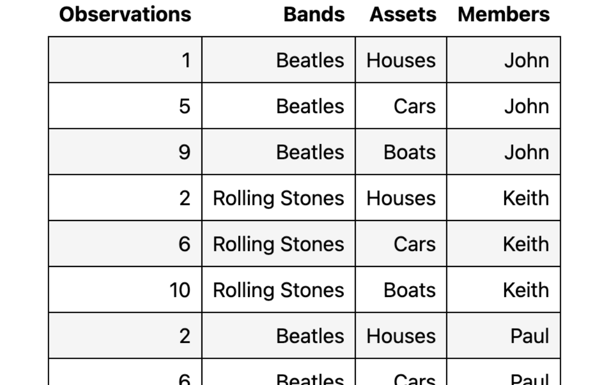

# Tidychef

Tidychef is a python framework to enable “data extraction for humans” via simple python beginner friendly "recipes". It aims at allowing users to easily transform tabulated data sources that use visual relationships (human readable only data) into simple machine readable "tidy data" in a way that supports usage in ETL processes.

i.e: it allows you to reliably turn something that looks like this: 

into something that looks like this:

_Note: the above image was cropped short for practical reasons_.

Tidychef provides a simple api suitable for **data analysts or people just beginning their journey with python** but is built to be _highly_ extensible as needed and can be configured to support niche use cases and/or domain specific tabulated data sources.
